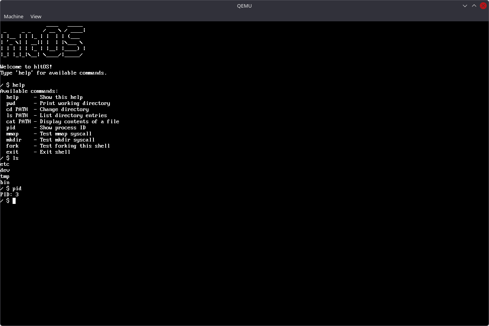

# *hlt*OS

An x86_64 operating system for hobbyists, learning, and teaching. Written in C++23 and assembly.



## Disclaimer

**This is a hobby operating system project for educational purposes.**

- ⚠️ Not production-ready or security-hardened
- ⚠️ May contain bugs or undefined behavior
- ⚠️ **Not recommended for use on real hardware**
- ✅ Safe for use in virtual machines (QEMU, VirtualBox, etc.)

Use at your own risk. The author(s) are not responsible for any damage, data loss, or hardware issues that may result from running this software.

## Target Architecture

**Target:** x86_64 (AMD64/Intel 64)
- Requires APIC support (LAPIC + IOAPIC)
- Uses Limine bootloader protocol
- Tested on: QEMU

## Features

### Memory Management
- Physical memory manager (PMM) with bitmap allocator
- Virtual memory manager (VMM) with 4-level paging via explicit, bitfield-typed `PML4E`/`PDPTE`/`PDE`/`PTE` structs and spinlock-protected page table mutation
- Higher-half kernel with HHDM (Higher Half Direct Map)
- Slab allocator for efficient small object allocation (32-1024 bytes)
- Per-process address spaces with user/kernel separation, hardened via CR4 `SMEP`/`SMAP`/`UMIP` — kernel code can't execute or touch user pages without explicit `stac`/`clac`

### Filesystem
- Unix-like VFS via a polymorphic `Inode` base class (`fd->inode->read()`, `write()`, etc. — virtual dispatch, no separate ops table)
- Initramfs (tar-based) mounted at `/`
- Devfs mounted at `/dev`
  - `/dev/tty1` - TTY with line editing and command history
  - `/dev/null` - Null device
- Path canonicalization (`.`, `..`, redundant slashes)

### Process Management
- ELF64 binary loading from initramfs
- Ring 3 userspace execution
- Kernel threads (`process::create_kthread`) for in-kernel background work (e.g. the framebuffer compositor), alongside full ELF user processes
- Unified, spinlock-protected `context_switch()` used for all scheduling paths — both preemptive (APIC timer) and cooperative (`yield_blocked`/`yield_dead`/`yield_zombie`)
- Process states: NEW, RUNNING, READY, BLOCKED, SLEEPING, DEAD, ZOMBIE
- Per-process page tables and file descriptor tables
- `fork()` with true address-space cloning (PML4 + heap clone) — child resumes independently via a dedicated trampoline
- `wait()`/`wait4()` (including `pid == -1` for "any child") with race-free zombie reaping: exiting processes persist as `ZOMBIE` until a parent collects `exit_status`, then a periodic reaper kthread frees fully-reaped (`DEAD`) processes

### Syscalls
- File I/O: `sys_read`, `sys_write`, `sys_readv`, `sys_writev`, `sys_open`, `sys_close`, `sys_ioctl`
- Filesystem/paths: `sys_stat`, `sys_fstat`, `sys_lseek`, `sys_getcwd`, `sys_chdir`, `sys_fchdir`, `sys_mkdir`, `sys_fcntl`, `sys_getdents64`
- Process: `sys_getpid`, `sys_fork`, `sys_wait4`, `sys_exit`/`sys_exit_group`, `sys_set_tid_address`, `sys_arch_prctl`
- Memory: `sys_brk`, `sys_mmap`, `sys_munmap`
- Timing: `sys_sleep_ms` (via `SYS_NANOSLEEP`) for timed blocking

### Hardware Support
- GDT with ring 0/3 segments
- IDT with interrupt/exception handling
- ACPI table parsing (RSDP, XSDT, MADT)
- APIC support (LAPIC + IOAPIC)
- PS/2 keyboard driver with scancode translation
- Double-buffered framebuffer console with PSF font rendering, flushed at a fixed 30fps by a dedicated kernel thread (not the timer ISR)
- Serial output (COM1) for kernel logging

### Infrastructure
- Dynamic containers (`kstring`, `kvector`, `klist`)
- Spinlocks matched to context: `kspinlock` (preemption-only) for data only touched by threads/kthreads, `kspinlock_irqsave` (also masks interrupts) for data shared with IRQ handlers
- In-kernel unit test framework (780+ assertions)
- Modern C++23 with freestanding implementation

## Project Structure

```
os/
├── src/
│   ├── kernel/
│   │   ├── kernel.cpp              # Kernel entry point
│   │   ├── include/                # Kernel headers
│   │   │   ├── arch.hpp            # Architecture abstraction
│   │   │   ├── acpi/               # ACPI table parsing
│   │   │   ├── algo/               # Algorithm headers
│   │   │   ├── boot/               # Boot info structures
│   │   │   ├── console/            # Console/TTY interface
│   │   │   ├── containers/         # kstring, kstring_view, kvector, klist
│   │   │   ├── crt/                # C runtime support
│   │   │   ├── exclusive/          # kspinlock, kspinlock_irqsave, katomic
│   │   │   ├── fmt/                # Kernel string formatting
│   │   │   ├── framebuffer/        # Framebuffer compositor
│   │   │   ├── fs/                 # VFS, initramfs, devfs, tmpfs
│   │   │   ├── kassert/            # Kernel assertions
│   │   │   ├── kpanic/             # Kernel panic
│   │   │   ├── kprint/             # Low-level kernel printing
│   │   │   ├── log/                # Kernel logging
│   │   │   ├── memory/             # PMM, VMM, slab, kmalloc
│   │   │   ├── process/            # Process management
│   │   │   ├── scheduler/          # Process scheduler
│   │   │   ├── syscall/            # Syscall declarations
│   │   │   ├── timer/              # Timer interface
│   │   │   └── linux/              # Linux uapi headers (ioctl, etc.)
│   │   ├── lib/                    # Implementations
│   │   │   ├── acpi/               # ACPI parsing
│   │   │   ├── algo/               # Algorithms
│   │   │   ├── boot/               # Boot initialization
│   │   │   ├── console/            # Console implementation
│   │   │   ├── crt/                # C runtime support
│   │   │   ├── framebuffer/        # Framebuffer compositor
│   │   │   ├── fs/                 # VFS, initramfs, devfs, tmpfs
│   │   │   ├── kpanic/             # Panic handler
│   │   │   ├── memory/             # PMM, VMM, slab, kmalloc
│   │   │   ├── process/            # ELF loader, process creation
│   │   │   ├── scheduler/          # Scheduler implementation
│   │   │   ├── syscall/            # Syscall implementations
│   │   │   └── timer/              # Timer implementation
│   │   ├── arch/x64/               # x86-64-specific code
│   │   │   ├── boot/               # Limine entry point
│   │   │   ├── context/            # Context switching
│   │   │   ├── cpu/                # CPU utilities (rflags, pause, etc.)
│   │   │   ├── crt/                # Arch-level C runtime (ctors, etc.)
│   │   │   ├── gdt/                # Global Descriptor Table
│   │   │   ├── interrupts/         # IDT, IRQ handling
│   │   │   ├── memory/             # VMM implementation
│   │   │   ├── percpu/             # Per-CPU state
│   │   │   ├── tls/                # Thread-local storage
│   │   │   ├── trap/               # Syscall entry (LSTAR/SYSRET)
│   │   │   └── drivers/            # APIC, PIC, PIT, TSC, keyboard, serial
│   │   ├── test/                   # Unit tests
│   │   │   ├── algo/
│   │   │   ├── containers/         # kstring, kstring_view, kvector, klist
│   │   │   ├── exclusive/          # kspinlock, kspinlock_irqsave, katomic
│   │   │   ├── fmt/
│   │   │   ├── fs/
│   │   │   └── memory/             # PMM, VMM, slab, kmalloc
│   │   └── CONVENTIONS.md          # Code style guide
│   └── user/                       # Userspace programs (ELF binaries)
├── firmware/                       # Bundled OVMF firmware for QEMU
├── initramfs/                      # Files packaged into initramfs
│   └── bin/                        # Userspace binaries
├── build.sh                        # Build script
├── run-qemu.sh                     # Run the built ISO in QEMU
└── clang-format.sh                 # Run clang-format across the tree
```

See `src/kernel/CONVENTIONS.md` for namespace and code style conventions, and `DOCUMENTATION.md` for comment/doc conventions.

## Building

### Dependencies

**Build (required)**

| Tool | Purpose |
|------|---------|
| `cmake` 3.16+ | Build system |
| `gcc` / `g++` | Kernel and userspace compilation |
| `as` (GNU binutils) | Assembly (`.s` files) |
| `cc` | Compiles the bundled Limine host tool |
| `musl-gcc` | Userspace programs statically linked against musl libc |
| `xorriso` | ISO 9660 image creation |
| `tar` | Initramfs packaging |
| `make` | CMake build backend |

> **Note:** Limine (bootloader files + host tool) is bundled via CMake's `FetchContent` and built automatically on first configure — no host installation required. Internet access is needed on the first build to download it.

**Runtime (required to run the OS)**

| Tool | Purpose |
|------|---------|
| `qemu-system-x86_64` | Running the OS in a VM |
| KVM kernel module | Hardware acceleration (`-accel kvm`) |
| OVMF firmware | UEFI firmware for QEMU — bundled at `firmware/OVMF.fd`, with fallback to system edk2 |

**Optional / dev tooling**

| Tool | Purpose |
|------|---------|
| `clang-format` | Code formatting via `./clang-format.sh` |

### Build Commands

```bash
./build.sh
```

**Run in QEMU:**
```bash
./run-qemu.sh
```

## Architecture

### Boot Sequence
1. Limine loads kernel, initramfs, and provides framebuffer, memory map, RSDP
2. Early init sets up GDT, IDT, PMM, VMM with HHDM
3. Parse ACPI tables (MADT) for APIC configuration
4. Initialize LAPIC and IOAPIC for interrupt routing
5. Initialize drivers (keyboard, serial, console)
6. Mount initramfs at `/`, devfs at `/dev`
7. Load and run userspace programs from `/bin/`
8. Scheduler manages processes with preemptive multitasking

### VFS Architecture
```
sys_read(fd, buf, count)
  → fd->inode->read(fd, buf, count)    // virtual dispatch on Inode
        │
        ├─ TmpFileInode::read()        (tmpfs, regular files)
        │    └─ memcpy from in-memory data buffer
        │
        └─ DevTtyInode::read()         (devfs, char devices)
             └─ keyboard input / console output
```

### Key Design Decisions
- **Higher-half kernel**: Kernel mapped at high addresses via HHDM
- **Architecture abstraction**: `lib/` code uses `arch::` namespace, not `x64::` directly
- **Single dispatch VFS**: `fd->inode->read()` — direct virtual dispatch on `Inode`, no separate ops table
- **No huge pages**: page table walks always descend PML4→PDPT→PD→PT to a 4KB `PTE` (the `ps` bit is never set) — one code path, no special-casing 2MB/1GB mappings
- **Unified process resume path**: every suspension — preemptive (timer) or cooperative (`yield_blocked`/`yield_dead`/`yield_zombie`) — resumes through the same `context_switch()`/`kernel_rsp_saved`, not separate bookkeeping per suspension kind
- **Flat namespaces**: No `kernel::` prefix; subsystems use `fs::`, `pmm::`, `log::`, etc.
- **k-prefixed utilities**: Global types like `kstring`, `kvector`, `kprint()`
- **Modern C++**: C++23 with freestanding implementation, concepts, fold expressions

## License

GNU General Public License v3.0 — see `COPYING` for the full text. 
Vendored third-party code carries its own license; see `THIRD_PARTY_LICENSES`.

## Acknowledgments

Built following OS development resources:
- Intel Software Developer Manual
- OSDev Wiki
- Limine bootloader documentation
